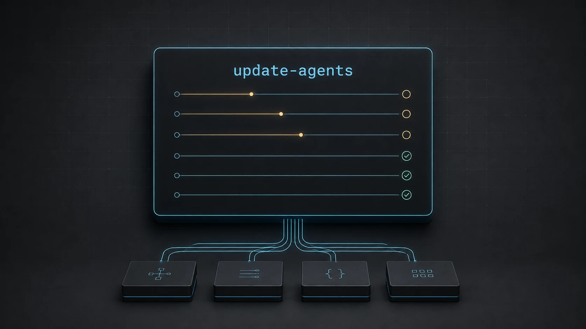

<h1 align="center">update-agents</h1>

<p align="center">
  Update your AI coding agents in parallel, from one terminal dashboard.
</p>

<p align="center">
  
  
  
  
</p>

<p align="center">
  
</p>

<p align="center"><sub>AI-generated concept illustration, not a screenshot of the terminal interface.</sub></p>

`update-agents` runs the update commands for your installed AI coding CLIs and
keeps their status, versions, and logs in one place. Use the interactive TUI,
plain terminal output, or a detached background run. New agents are added with
JSON descriptors, not Rust code.

## At a glance

| Capability | Behavior |
|---|---|
| Live dashboard | Follow each agent's status, elapsed time, version information, and recent log activity |
| Parallel updates | Bound concurrency with `--jobs`; agents sharing a resource run one at a time |
| Selective runs | Update every catalogue entry or pass only the agent IDs you need |
| Read-only preview | Inspect resolved commands and preflight status with `--list` or `--dry-run` |
| Not-detected tools | Executables missing from the search path stay out of the list, never fail the run, and are recorded in the report |
| Background mode | Detach with `--bg` and receive the PID, report path, and session log path |
| Run records | Save a structured `report.json`, updater output, and version-probe logs |
| Extensible catalogue | Add a JSON file with commands, a resource group, and optional safety checks |

> [!IMPORTANT]
> Running without IDs attempts to update every ready agent in the loaded
> catalogue. Preview with `--list` first. Descriptors execute real commands with
> your user permissions; review them before use.

## How it works

```text
JSON agent descriptors
    |
    v
Validate catalogue and check executable availability
    |
    v
Apply configured read-only safety checks
    |
    v
Bounded worker pool + shared-resource serialization
    |
    +--> Before version --> Update command --> After version on success
    |
    v
TUI or plain status output + per-agent logs + report.json
```

The default worker limit is the available CPU count, capped at the number of
selected agents. A resource group stays locked across the version probes and
update command, so tools sharing a package manager do not update concurrently
when their descriptors use the same resource.

## Requirements

- Linux. Process inspection uses `/proc`, and execution relies on Unix process
  groups, signals, and file locking.
- A Rust toolchain with Cargo and edition 2024 support to build from source.
- The coding CLIs you want to update, already installed and configured.
- Any updater dependencies required by their descriptors, such as `npm`, `bun`,
  or `uv`, plus network access when the updater needs it.
- An interactive terminal for the TUI. Non-terminal input or output, or
  `TERM=dumb`, selects plain mode automatically.

The bundled commands assume the installation methods listed below. For example,
OpenCode uses Bun, Kimi CLI and Vibe use uv, and Cline and Crush use npm. Review
or adapt the catalogue if your tools were installed differently.

## Build and install

Clone the repository and install the binary:

```bash
git clone https://github.com/yhzion/update-agents.git
cd update-agents
cargo install --locked --path .
```

Ensure Cargo's binary directory, normally `~/.cargo/bin`, is on your `PATH`.
Install the bundled catalogue separately; `cargo install` installs only the
binary:

```bash
case "${XDG_DATA_HOME:-}" in
  /*) data_home="$XDG_DATA_HOME" ;;
  *)  data_home="$HOME/.local/share" ;;
esac

install -d "$data_home/update-agents/agents.d"
install -m 644 agents.d/*.json "$data_home/update-agents/agents.d/"

update-agents --list
```

To inspect the checkout without installing either the binary or catalogue:

```bash
cargo run --locked -- --agents-dir ./agents.d --list
```

## Usage

```bash
# Inspect commands and preflight status without running updates
update-agents --list

# Update all catalogue agents in the interactive dashboard
update-agents

# Update only selected agents
update-agents claude codex omp

# Limit parallel work and set the per-update timeout
update-agents --jobs 4 --timeout 600

# Use non-interactive status output
update-agents --plain pi omp

# Run in the background; print PID, report, and session log paths
update-agents --bg --jobs 4

# Use only the descriptors in a specific directory
update-agents --agents-dir ./agents.d --dry-run
```

`--timeout` applies to each update command and defaults to 600 seconds. Version
probes have a separate 15-second limit. `--bg` always uses plain output and
cannot be combined with `--list` or `--dry-run`. Its launcher acknowledges
startup, not eventual update success; inspect the report for the final result.
Background completion also sends a best-effort notification when invoked from
tmux.

### Dashboard controls

| Key | Action while updates are running |
|---|---|
| `j` / `k` or arrow keys | Select an agent |
| `Enter` / `l` | Toggle the selected agent's log detail |
| `Page Up` / `Page Down` | Scroll the log detail, or page through the agent list |
| `?` | Toggle help |
| `q` / `Esc` | Request cancellation with confirmation |
| `Ctrl-C` | Cancel immediately |

After every job reaches a terminal state, the dashboard exits after five
seconds, or immediately on any key. The final summary and log paths remain in
the terminal. Plain and background runs do not wait for this countdown.

## Bundled agents

These are the commands in [`agents.d/`](agents.d/), not a promise that every
upstream installation supports the same update mechanism. `--list` shows the
resolved executable paths and preflight state on your machine.

| ID | Agent | Update command |
|---|---|---|
| `agy` | AGY | `agy update` |
| `amp` | Amp | `amp update` |
| `claude` | Claude Code | `claude update` |
| `cline` | Cline | `npm install -g cline@latest` |
| `codex` | Codex CLI | `codex update` |
| `crush` | Crush | `npm install -g @charmland/crush@latest` |
| `cursor-agent` | Cursor Agent | `cursor-agent update` |
| `dcode` | Deep Agents Code | `dcode update` |
| `droid` | Factory Droid | `droid update` |
| `goose` | Goose | `goose update` |
| `grok` | Grok CLI | `grok update` |
| `kimi` | Kimi CLI | `uv tool upgrade kimi-cli` |
| `kiro-cli` | Kiro CLI | `kiro-cli update -y` |
| `omp` | OMP | `omp update` |
| `opencode` | OpenCode | `opencode upgrade --method bun` |
| `pi` | Pi | `pi update self` |
| `prime-agent` | Prime Agent | `prime-agent update` |
| `qwen` | Qwen Code | `qwen update` |
| `vibe` | Vibe | `uv tool upgrade mistral-vibe` |

### Add or customize an agent

The default catalogue combines two directories:

| Directory | Purpose |
|---|---|
| `~/.local/share/update-agents/agents.d` | Required bundled catalogue |
| `~/.config/update-agents/agents.d` | Optional additional user descriptors |

Absolute `XDG_DATA_HOME` and `XDG_CONFIG_HOME` values replace the corresponding
base directories; empty or relative values fall back to the paths above.
`--agents-dir DIR` replaces both catalogues rather than merging with them.
Duplicate IDs are rejected, so user descriptors are additive, not overrides.
To customize an existing agent, edit its installed descriptor or use a separate
catalogue with `--agents-dir`.

For a CLI named `my-agent` that supports `update` and `--version`, an additional
`my-agent.json` can contain:

```json
{
  "schema_version": 1,
  "id": "my-agent",
  "label": "My Agent",
  "installed": "my-agent",
  "update": { "program": "my-agent", "args": ["update"] },
  "version": { "program": "my-agent", "args": ["--version"] },
  "version_line": 0,
  "resource": "my-agent",
  "failure_contains": [],
  "checks": []
}
```

- `installed` identifies the executable that must already exist. Missing
  installed, updater, or configured version executables produce a
  not-detected job (recorded as `skipped` in the report).
- `version` is optional. `version_line` selects a zero-based nonempty line of its
  output and defaults to `0`.
- `resource` defaults to the agent ID. Use a shared value, such as `npm-global`,
  when several agents must not update concurrently.
- `failure_contains` holds case-sensitive output markers that make a job fail
  even if its updater exits successfully.
- `checks` accepts `git_clean` with a `path`, or `process_absent` with
  `cmdline_contains` literals. A failed or unverifiable check blocks the agent.

Programs and arguments are passed directly, without an implicit shell. Malformed
JSON, unsupported schema versions, unknown fields, and duplicate IDs abort
startup before any update command runs. See `update-agents --help` for the
schema and safety-check examples.

## Execution and safety

- **No automatic installation:** executables that are
  not detected are left out of the run list. The runner does not install
  missing agents or updater dependencies.
- **One run per state directory:** a file lock prevents overlapping runs using
  the same state directory and stays held while workers are active.
- **Bounded cancellation:** timeouts and cancellation send `SIGTERM` to each
  active command's process group, then escalate to `SIGKILL` if needed.
- **Non-interactive children:** updater stdin is closed, output goes directly
  to log files, and commands start in `$HOME` rather than your project directory.
- **Opt-in safety checks:** the runner supports worktree and process gates, but
  the bundled descriptors currently use empty `checks` arrays. It does not
  automatically detect every running agent session or unsafe installation.
- **Not a sandbox:** descriptors and upstream updaters run with your permissions.
  Update commands can modify installed tools; cancellation does not roll back
  changes already made. Review logs before sharing them, as upstream output may
  contain sensitive information.

## Reports and exit codes

Each run writes under:

```text
~/.local/state/update-agents/runs/<time>-<pid>/
```

An absolute `XDG_STATE_HOME` overrides `~/.local/state`. The run directory
contains `report.json`, `<agent-id>.log` for executed updates, and
`<agent-id>.before.log` / `<agent-id>.after.log` when those version probes run.
Background runs also capture terminal output in `session.log`.

The report records counts and per-agent status, commands, before/after version
text, exit code, elapsed time, messages, and log paths,
including not-detected (recorded as `skipped`) and blocked agents. A
successful update status reflects the updater's exit result and configured
failure markers, not a guarantee that its version changed.

| Exit code | Meaning |
|---|---|
| `0` | Every selected agent succeeded or was not detected |
| `1` | An update failed, timed out, or was cancelled; also used for startup I/O and lock failures |
| `2` | Invalid arguments, unknown agent IDs, or a catalogue error; no updates ran |
| `3` | No updates failed, but at least one agent was blocked |

## Development

```bash
cargo fmt --check
cargo clippy --locked --all-targets -- -D warnings
cargo test --locked
cargo build --locked --release
```

The implementation is split by responsibility:

| Path | Responsibility |
|---|---|
| [`src/main.rs`](src/main.rs) | CLI options, catalogue selection, run lock, background mode, and exit codes |
| [`src/catalog.rs`](src/catalog.rs) | Descriptor validation, executable resolution, and preflight checks |
| [`src/engine.rs`](src/engine.rs) | Scheduling, process management, log capture, and JSON reports |
| [`src/ui.rs`](src/ui.rs) | Live Ratatui dashboard and keyboard controls |
| [`src/model.rs`](src/model.rs) | Shared command, job, and run-state types |
| [`agents.d/`](agents.d/) | Bundled agent descriptors |
